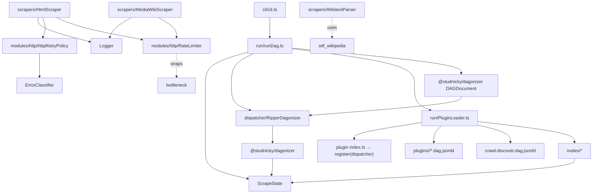
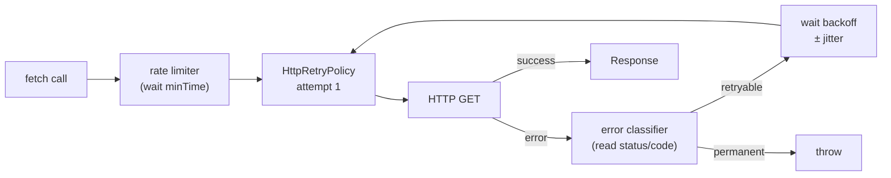

# Architecture

Ripperoni is built on top of [@studnicky/dagonizer](https://github.com/Studnicky/Dagonizer). Dagonizer provides the DAG model — the graph of steps and what runs after what — the `DAGBuilder` for composing those graphs, the scatter mechanism for concurrent fan-out, embedded DAGs for nesting one graph inside another, and the dispatcher that executes a run. Everything described here is what Ripperoni adds on top of that foundation: the scrape-specific nodes, state, HTTP machinery, scrapers, and the native DAG-document model that wires them together.

A **DAG** (directed acyclic graph) is a sequence of steps where each step declares which step runs next based on its outcome. A **node** is a single step in that graph — it reads from shared state, does its work, and returns a named output port (`success`, `error`, `cached`, …) that tells the dispatcher which edge to follow. **Dagonizer** is the library that defines these primitives and runs the graph.

## Core model

A scrape run is three authored artifacts:

1. **Plugin(s)** — `plugins/<namespace>/`: `ScalarNode` subclasses (node implementations) + `*.dag.jsonld` DAG documents + `index.ts` exporting `register(dispatcher)` that registers node instances only (DAGs are loaded from files by the runner).
2. **Orchestration document** — `<name>.dag.jsonld`: one dagonizer DAG that imports plugin DAGs via `ScatterNode { body: { dag } }` (fan-out) or `EmbeddedDAGNode { dag }` (single invocation).
3. **State** — `<name>.state.json`: run params validated by `RunStateSchema` (baseUrl, cache, output, crawler config, the optional `urls` page list, `parallelWorkers`).

Run it:

```bash
ripperoni run <name>.dag.jsonld --state <name>.state.json
```

## Module graph



<section data-component="pipeline">

## DAG dispatch

<p class="summary">Directed acyclic graph orchestration powered by @studnicky/dagonizer — every node declares named output ports, scatter handles concurrency, and state flows checkpoint-ready through the run.</p>

Ripperoni executes scrape runs as dagonizer DAGs loaded from committed `.dag.jsonld` documents. The runner (`runDag`) loads an orchestration document via `DAGDocument.load`, discovers plugin namespaces from its placements, registers builtin nodes + crawl DAG, loads plugin DAGs and node instances, registers the orchestration, and dispatches.

**Node contract:** Every built-in task (`html:fetch`, `json:write`, etc.) and every plugin node is a `ScalarNode<ScrapeState, TOutputs, RipperServices>` subclass that implements `executeOne` and returns `NodeOutputBuilder.of('<port>')`. The dispatcher routes to the next placement based on the returned port.

**Scatter and embedded DAG:** `ScatterNode` fans out over an array in state (e.g. `source: "urls"`), running its `body.dag` once per item. `EmbeddedDAGNode` runs its `dag` as a single nested invocation. Both types are placement discriminants (`@type`) in the JSON-LD.

**Parallel parse:** When `state.parallelWorkers: true`, the runner binds a `WorkerThreadContainer` to the "worker" role. ScatterNode placements that declare `container: "worker"` route to the worker thread pool. Build the worker tree with `npm run build:workers`.

**Crawler:** Link discovery is the builtin `crawl:discover` DAG — a cyclic BFS embedded in the orchestration via `EmbeddedDAGNode { dag: "crawl:discover" }` with a `stateMapping` that seeds `urls` from `crawl.discovered`. The cyclic back-edge from `crawl:dedupe-and-enqueue` → `crawl:fetch-and-extract` re-executes in place until the frontier empties or a budget limit is reached.

**Result-array contract:** `ScrapeState` carries three terminal result arrays: `succeeded` (first-attempt successes), `recovered` (succeeded on retry), `failedAfterRetry` (failed both). The transient `failed` array is meaningful only mid-run.

**Resilience layer:** `html:fetch` stashes a `FailureContextType` under `LAST_FAILURE_KEY` on failure and emits `error`. The `route:failure` node reads that context, increments the attempt counter, and delegates to `FailurePolicyInterface.classify` — returning `retry` (back-edge to `html:fetch`), `resolve` (on to `resolve:link` for wrong-locator recovery), `capture` (on to `error:capture`), or `expected` (terminal). `error:capture` projects `state.errors` into a `{ _type: 'error', url, errors }` document that `json:write` persists — failures are written data, not silent drops. After the scatter, the orchestration runs `reconcile:identity` (reads all per-page docs, builds a plugin-supplied identity index via `ReconcilerInterface`, classifies each failure `capturedElsewhere | missing | dead`, and writes the verdict back into each error doc) then `report:crawl-health` (writes `<outDir>/<target>/crawl-health.json` with totals and per-classification URL lists). See [Resilience & crawl-health](/usage/resilience) for the full model.

**Registration order is load-bearing:** Node instances must be registered before any DAG that references them; leaf/plugin DAGs before the orchestration DAG that embeds them. `PluginLoader` enforces this ordering automatically.

### Runner flow

```
1. DAGDocument.load(orchestrationJson) → entry DAGType
2. RunStateSchema.validate(stateJson) → RunStateType
3. Build services (cache, htmlScraper, wikiScraper) from state
4. PluginLoader.registerBuiltinNodes(dispatcher)     ← builtin nodes + crawl:discover DAG
5. PluginLoader.registerPluginsFromEntry(...)         ← plugin nodes + *.dag.jsonld files
6. dispatcher.registerDAG(entryDag)                  ← orchestration registered last
7. Seed ScrapeState; scrapeState.params = state; seed scrapeState.urls when present
8. dispatcher.execute(dag.name, scrapeState)
9. Write failures.json when failedAfterRetry.length > 0
```

### Plugin DAGs

Every plugin ships its DAGs as committed `.dag.jsonld` files in its directory. The runner loads every `*.dag.jsonld` from the plugin directory and registers them in dependency order (leaves first). The `register(dispatcher)` function exported from `index.ts` registers node **instances** only — DAGs are not registered in `register`.

#### Plugin DAG: aonprd:parse

The AONPRD plugin is **taxonomy-routed**. Its entrypoint `aonprd:taxonomy-route` classifies each page from its URL and dispatches to that concept's inherited capability chain (spell, monster, feat, weapon, …); unrecognised pages route to `aonprd:make-unknown`. The DAG is built from the concept taxonomy by `TAXONOMY.buildDAG()`. See the [AONPRD Scraper DAG](/aonprd-scraper-dag) walkthrough for full composition.

#### Plugin DAG: dnd5e:parse

The D&D 5e plugin is **taxonomy-routed via content classification**. Because dandwiki URLs do not encode the concept type, `dnd5e:taxonomy-route` classifies each page by content (spell stat block, breadcrumb category, italic type line) and dispatches to the matching concept's capability chain; unrecognised pages route to `dnd5e:unknown-end`. The DAG is built from the shared taxonomy compiler (`src/taxonomy/Taxonomy.compile`) with `namespace: 'dnd5e'`. See the [D&D 5e Scraper DAG](/dnd5e-scraper-dag) page for the typed `SpellOutput` shape and direct-call API.

```mermaid
<!--@include: ./_generated/dnd5eParseDAG.mmd -->
```

#### Plugin DAG: docs-scraper

```mermaid
<!--@include: ./_generated/docsScraperDAG.mmd -->
```

#### Plugin DAG: wiki-docs

```mermaid
<!--@include: ./_generated/wikiDocsDAG.mmd -->
```

### Node signature

```ts
interface NodeInterface<TState, TOutput extends string, TServices = undefined> {
  readonly name:    string;
  readonly outputs: readonly TOutput[];
  execute(state: TState, context: NodeContextInterface<TServices>): Promise<{ output: TOutput }>;
}
```

Nodes never throw. Errors are recorded via `state.collectError(err)` and a deterministic port (`error`, `invalid`, `empty`) is returned so the DAG can route to a failure handler or terminate cleanly.

</section>

<section data-component="http-layer">

## HTTP machinery

<p class="summary">Three composable classes — RateLimiter, HttpRetryPolicy, and ErrorClassifier — form the HTTP stack, each injected independently.</p>

Three composable classes (`RateLimiter`, `HttpRetryPolicy`, and `ErrorClassifier`) form the HTTP stack, each injected independently.

HTTP is unreliable. Networks fail. Servers get overloaded and 429. Caches go stale. When Ripperoni fetches a page, it retries transient errors, gives up on permanent ones, respects `Retry-After` headers, and throttles to avoid hammering the target server — the stack is thorough but knows when to stop. The three-class stack keeps these concerns separate so you can swap implementations or compose them differently in tests.

Error propagation: An error enters `ErrorClassifier`, which examines the error object or HTTP status code. Retryable classifications (`NETWORK`, `TIMEOUT`, `THROTTLED`, `TRANSIENT`) return to `HttpRetryPolicy`, which waits and tries again. Permanent classifications (`PERMANENT`, `VALIDATION`, `RESOURCE`) throw immediately. A 404 is permanent. A 500 is transient. A 429 is throttled, with `Retry-After` delay applied.

Cache and retry interaction: The cache sits upstream of this stack. A cache hit bypasses the entire HTTP machinery and returns the cached body directly to the pipeline. A cache miss enters the HTTP stack: the rate limiter enforces its minimum gap, `HttpRetryPolicy` calls fetch, and `ErrorClassifier` decides whether to retry. On success, the response is cached. The first fetch of a URL pays the full HTTP and retry cost; subsequent fetches return from cache.



### ErrorClassifier

Classifies errors into seven categories. Only NETWORK, THROTTLED, TIMEOUT, and TRANSIENT are retryable. Permanent 4xx errors throw immediately. Reads `Retry-After` header for THROTTLED back-off hint.

| Category | Retryable | Trigger |
|----------|-----------|---------|
| `NETWORK` | yes | `ECONNREFUSED`, `ECONNRESET`, `ENOTFOUND` |
| `TIMEOUT` | yes | `ETIMEDOUT`, `ESOCKETTIMEDOUT` |
| `THROTTLED` | yes | HTTP 429 · reads `Retry-After` |
| `TRANSIENT` | yes | HTTP 5xx |
| `PERMANENT` | no | HTTP 4xx (except 429) |
| `VALIDATION` | no | `TypeError`, `SyntaxError`, `ValidationError` |
| `RESOURCE` | no | `ENOMEM`, `ENOSPC` |

Retry-After handling: When a server returns HTTP 429 with a `Retry-After` header (in seconds or RFC 1123 date), `ErrorClassifier` extracts the value and returns it as a `backoffHint`. `HttpRetryPolicy` uses this hint as the delay before the next attempt, overriding the exponential backoff curve. When `Retry-After` is malformed or absent, backoff follows the exponential schedule.

### HttpRetryPolicy

A `RetryPolicy` subclass (from `@studnicky/dagonizer/runtime` — dagonizer's built-in retry abstraction) constructed via `HttpRetryPolicy.create({ ... })` and run with `policy.run(fn)`. It overrides `shouldRetry` to consult `ErrorClassifier.classify()` and `getDelay` to honour the `backoffHint` from a `Retry-After` header on HTTP 429. For every other retryable category it uses the `DECORRELATED_JITTER` backoff strategy.

Backoff: decorrelated-jitter growth from `baseDelayMs`, capped at `maxDelayMs`. For `baseDelayMs=500, maxDelayMs=30000`, attempt 1 waits ~500ms and successive attempts grow with jitter up to the 30s ceiling. The jitter keeps multiple clients from retrying in lockstep. Delay waits run through the dagonizer `Scheduler`, so tests can install a `VirtualScheduler` to advance time deterministically.

| Option | Default | Description |
|--------|---------|-------------|
| `maxAttempts` | `3` | Total attempts before throw (includes first try; `1` disables retries). |
| `baseDelayMs` | `500` | Initial delay before the first retry. |
| `maxDelayMs` | `30000` | Delay ceiling. |

### RateLimiter

Token-bucket backed by `bottleneck`. Factory methods: `RateLimiter.perSecond(n)` for throughput-based limits, `RateLimiter.withDelay(ms)` for fixed-gap limits. Used by every scraper and crawler.

Rate limiting applies per request. With `rateLimitMs: 1000`, every fetch is at least 1000ms apart. With `jitterMs: 250`, an additional 0–250ms random delay is added per request. Jitter prevents synchronized bursts when multiple tasks start together. The limiter enforces its minimum gap before the HTTP call enters the retry policy, so each retry attempt waits its own `minTime` before executing.

</section>

<section data-component="scrapers">

## Scrapers

<p class="summary">Pure data accessors for HTML (via cheerio) and MediaWiki (via native fetch) that return typed results without coupling to the DAG graph.</p>

Pure data accessors for HTML (via cheerio) and MediaWiki (via native fetch) that return typed results without coupling to the DAG graph.

### HtmlScraper

Native `fetch` + `cheerio`. Returns `ScrapedPageInterface { url, $, html }`. The `$` field is a live `CheerioAPI` handle; use it exactly as you'd use jQuery on a DOM. For JS-rendered pages, swap the fetch call for a headless driver (Playwright, Puppeteer) and feed the HTML to `cheerio.load()`.

### MediaWikiScraper

Direct `fetch()` calls to the MediaWiki JSON API. Four operations:

- `fetchPage(title)`: single page wikitext
- `fetchPagesBatch(titles)`: up to 50 pages per API request
- `fetchCategory(name)`: paginated category members list
- `fetchAllPages()`: enumerates every article in main namespace via `action=query&list=allpages`

Rate limiting and jitter applied per-request.

### WikitextParser

Wraps `wtf_wikipedia`. `WikitextParser.parse(title, wikitext)` returns a `ParsedPageInterface` with `infobox` (flat key→value record), `sections` (title + raw wikitext), and `categories`. Helper methods `infoboxField` and `infoboxNumber` pull typed values without null-checks at call site.

</section>

<section data-component="crawler">

## Link crawler

<p class="summary">Recursive link crawler controlled by three regexes (domain, delimiter, target) that bound traversal and collect matching URLs.</p>

The link crawler runs as the builtin `crawl:discover` embedded DAG — a cyclic BFS that fetches each frontier page, extracts links matching the crawler's `delimiter` (traversable) and `target` (collectable), deduplicates, and promotes the next frontier via a back-edge until the frontier empties or a budget/depth limit is hit.

Embed it in an orchestration:

```json
{
  "@type": "EmbeddedDAGNode",
  "name": "discover",
  "dag": "crawl:discover",
  "stateMapping": {
    "output": { "urls": "crawl.discovered" }
  },
  "outputs": { "success": "scrape", "error": "crawl-failed" }
}
```

Configure via the `crawler` block in `state.json`. Three regexes control behavior:

| Regex | Purpose |
|-------|---------|
| `domain` | Links must match to be considered at all. Keeps the crawler inside the target site. |
| `delimiter` | Links that match are traversed (followed). Links that don't match are skipped. |
| `target` | Links that match the delimiter AND this pattern are collected as results. Others are traversed but not returned. |

Visited URLs are tracked in a `Set`. Results are deduplicated and sorted with a numeric-aware collator; `Item-10` sorts after `Item-9`, not between `Item-1` and `Item-2`.

</section>

<section data-component="source-map">

## Source map

<p class="summary">Complete index of every source module, its primary exports, and its role in the scrape run.</p>

### State classes

| File | Exports | Role |
|------|---------|------|
| `src/state/ScrapeState.ts` | `ScrapeState` | Extends `NodeStateBase`; carries per-URL page, result buckets, params, and output |
| `src/state/LinkCrawlState.ts` | `LinkCrawlState` | State for the builtin `crawl:discover` DAG |

### Dispatcher

| File | Exports | Role |
|------|---------|------|
| `src/dispatcher/RipperDagonizer.ts` | `RipperDagonizer`, `RipperDagonizerOptionsType` | `Dagonizer` subclass with component-scoped lifecycle logging |

### Services

| File | Exports | Role |
|------|---------|------|
| `src/services/RipperServices.ts` | `RipperServices` | Services bag type injected into every node via `context.services` |

### Built-in pipeline nodes

| File | Exports | Output ports |
|------|---------|--------------|
| `src/nodes/HtmlFetchNode.ts` | `HtmlFetchNode` | `success \| error \| cached` |
| `src/nodes/WikiFetchNode.ts` | `WikiFetchNode` | `success \| error` |
| `src/nodes/HtmlWriteRawNode.ts` | `HtmlWriteRawNode` | `success` |
| `src/nodes/WikiWriteRawNode.ts` | `WikiWriteRawNode` | `success` |
| `src/nodes/JsonWriteNode.ts` | `JsonWriteNode` | `success \| skipped` |
| `src/nodes/JsonlAppendNode.ts` | `JsonlAppendNode` | `success \| skipped` |
| `src/nodes/ValidateSchemaNode.ts` | `ValidateSchemaNode` | `valid \| invalid` |
| `src/nodes/TerminalNode.ts` | `TerminalNode` | `success` — no-op terminator |

### Resilience nodes (`src/nodes/`)

| File | Exports | Output ports |
|------|---------|--------------|
| `src/nodes/RouteFailureNode.ts` | `RouteFailureNode` | `retry \| resolve \| capture \| expected` — policy-driven failure router |
| `src/nodes/CaptureErrorNode.ts` | `CaptureErrorNode` | `captured` — projects `state.errors` into a `{ _type: 'error' }` doc |
| `src/nodes/ResolveLinkNode.ts` | `ResolveLinkNode` | `resolved \| unresolved` — opt-in wrong-locator URL recovery |
| `src/nodes/ReconcileIdentityNode.ts` | `ReconcileIdentityNode` | `done` — post-crawl identity reconciliation; writes verdict into each error doc |
| `src/nodes/ReportCrawlHealthNode.ts` | `ReportCrawlHealthNode` | `done` — writes `<outDir>/<target>/crawl-health.json` |

### Resilience modules (`src/resilience/`)

| File | Exports | Role |
|------|---------|------|
| `src/resilience/FailurePolicy.ts` | `FailurePolicyInterface`, `DefaultFailurePolicy`, `LAST_FAILURE_KEY` | Failure classification contract and default retry-then-capture implementation |
| `src/resilience/Reconciler.ts` | `ReconcilerInterface`, `DefaultReconciler`, `RECONCILIATION_KEY` | Post-crawl identity reconciliation contract and conservative no-op default |
| `src/resilience/LinkResolve.ts` | `LinkResolverStrategyInterface`, `LinkResolverRegistry` | Wrong-locator URL recovery strategies (`crossLocator`, `canonical`, `search`) |

### Link-crawl nodes (`src/nodes/crawl/`)

| File | Exports |
|------|---------|
| `InitFrontierNode.ts` | `InitFrontierNode` |
| `FetchAndExtractLinksNode.ts` | `FetchAndExtractLinksNode` |
| `DedupeAndEnqueueNode.ts` | `DedupeAndEnqueueNode` |
| `CrawlExhaustedNode.ts` | `CrawlExhaustedNode` |

### Crawl DAG document

| File | Role |
|------|------|
| `src/crawlers/crawl-discover.dag.jsonld` | Builtin cyclic BFS crawler DAG; loaded by `PluginLoader.registerBuiltinNodes` |

### Entry points

| File | Exports | Role |
|------|---------|------|
| `src/run/runDag.ts` | `runDag`, `runDagFromFiles` | Reads `.dag.jsonld` + `.state.json`, builds services, registers plugins, dispatches |
| `src/run/PluginLoader.ts` | `PluginLoader` | Static class: `registerBuiltinNodes`, `registerPluginsFromEntry`, `derivePluginTaskName`, `pluginDagsInRegistrationOrder` |
| `src/cli/cli.ts` | `ripperoni` CLI | `commander`-based CLI; `run` and `scaffold` commands |

### Types

| File | Exports | Role |
|------|---------|------|
| `src/types/RunState.ts` | `RunStateType` | Typed run params (validated by `RunStateSchema`) |
| `src/schemas/internal/RunStateSchema.ts` | `RunStateSchema` | AJV schema for state.json |

### HTTP modules

| File | Exports | Role |
|------|---------|------|
| `src/modules/http/errorClassifier.ts` | `ErrorClassifier`, `ClassificationResultType` | Classifies errors into seven retry/permanent categories |
| `src/modules/http/httpRetryPolicy.ts` | `HttpRetryPolicy`, `HttpRetryConfigType` | Exponential backoff with jitter; wraps any async fetch |
| `src/modules/http/rateLimiter.ts` | `RateLimiter` | Token-bucket limiter backed by `bottleneck` |
| `src/modules/http/time.ts` | `Time` | Timing and delay utilities |

### Other modules

| File | Exports | Role |
|------|---------|------|
| `src/modules/logger/logger.ts` | `Logger` | Component-scoped structured logger |
| `src/modules/cache/ScraperCache.ts` | `ScraperCache` | Per-target HTML cache; miss triggers HTTP fetch |

### Taxonomy compiler (`src/taxonomy/`)

Plugin-agnostic shared infrastructure for concept-taxonomy-routed plugins. Any plugin that dispatches per concept compiles against this module.

| File | Exports | Role |
|------|---------|------|
| `src/taxonomy/Taxonomy.ts` | `Taxonomy` | `Taxonomy.compile(concepts, options)` — produces capability chains, `routeUrl`, `chainFor`, `allNodes`, `buildDAG` |
| `src/taxonomy/TaxonomyRouterNodes.ts` | `makeTaxonomyRouter`, `makeConceptDispatch`, `conceptIdKey` | Namespaced router node factories (`<namespace>:taxonomy-route`, `<namespace>:concept-dispatch`) |
| `src/taxonomy/ExtractionStrategy.ts` | `CommonStrategy`, `SourceRef`, `LinkRef`, `Section` | Extraction strategy interfaces shared across concept implementations |
| `src/taxonomy/TaxonomyCompileOptions.ts` | `TaxonomyCompileOptions` | `{ namespace, pathExtractor }` options type for `Taxonomy.compile` |

### Scrapers

| File | Exports | Role |
|------|---------|------|
| `src/scrapers/HtmlScraper.ts` | `HtmlScraper`, `ScrapedPageType` | Native `fetch` + `cheerio`; returns `ScrapedPageType { url, $, html }` |
| `src/scrapers/MediaWikiScraper.ts` | `MediaWikiScraper`, `WikiPageType`, `CategoryMemberType` | Direct `fetch()` to MediaWiki JSON API |
| `src/scrapers/WikitextParser.ts` | `WikitextParser`, `ParsedPageType` | `wtf_wikipedia` wrapper; returns infobox, sections, categories |

### Errors

| File | Exports | Role |
|------|---------|------|
| `src/errors/BaseError.ts` | `BaseError`, `BaseErrorOptionsType` | Base structured error class |
| `src/errors/HttpError.ts` | `HttpError` | HTTP-layer structured error |
| `src/errors/ExternalSchemaError.ts` | `ExternalSchemaError` | Node-level contract violation |
| `src/errors/CacheMissError.ts` | `CacheMissError` | Cache miss signal |

</section>
