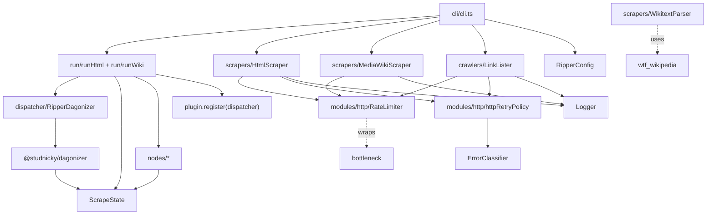
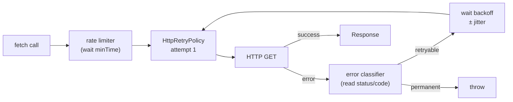

# Architecture

Ripperoni is built on top of [@studnicky/dagonizer](https://github.com/Studnicky/Dagonizer). Dagonizer provides the DAG model — the graph of steps and what runs after what — the `DAGBuilder` for composing those graphs, the scatter mechanism for concurrent fan-out, embedded DAGs for nesting one graph inside another, and the dispatcher that executes a run. Everything described here is what Ripperoni adds on top of that foundation: the scrape-specific nodes, state, HTTP machinery, scrapers, and the config-driven pipeline that wires them together.

A **DAG** (directed acyclic graph) is a sequence of steps where each step declares which step runs next based on its outcome. A **node** is a single step in that graph — it reads from shared state, does its work, and returns a named output port (`success`, `error`, `cached`, …) that tells the dispatcher which edge to follow. **Dagonizer** is the library that defines these primitives and runs the graph.

Three cuts off the same block — **pipeline**, **HTTP machinery**, and **scrapers** — compose to produce a scraping job. The pipeline has no knowledge of HTTP. The HTTP layer has no knowledge of MediaWiki. The scraper classes are pure data accessors that return typed results.

## Module graph



<section data-component="pipeline">

## DAG dispatch

<p class="summary">Directed acyclic graph orchestration powered by @studnicky/dagonizer — every node declares named output ports, scatter handles concurrency, and state flows checkpoint-ready through the run.</p>

Ripperoni builds every scrape with dagonizer's `DAGBuilder`. A run nests four DAG levels: an **outer flow** that composes three **phase** DAGs (discovery, scrape, retry) via `embeddedDAG` placements (a dagonizer primitive that nests one complete DAG as a single step inside another), and a **per-page** DAG that `DAGBuilder` assembles from the steps declared in a target's config — one node per step, wired in order. Each phase is independently dispatchable for tests.

**Node contract:** Every built-in task (`html:fetch`, `json:write`, etc.) and every user plugin is a `ScalarNode<ScrapeState, TOutputs, RipperServices>` subclass — the dagonizer base class for single-item nodes — that implements `executeOne` and returns `NodeOutputBuilder.of('<port>')`. The class satisfies `NodeInterface<ScrapeState, TOutputs, RipperServices>`: it declares named output ports (e.g. `success | error | cached`) and mutates `ScrapeState`. The dispatcher routes to the next placement based on the returned port.

**Phase composition:** The outer DAG embeds each phase as an `embeddedDAG` placement with explicit `inputs`/`outputs` state mappings — the mapping seeds the child DAG's inputs and copies the relevant result buckets back to the parent. Each outer DAG ends at a `terminal` placement (`{ outcome: 'completed' }`) that owns END.

**Failure retry:** Items that fail their first per-page DAG dispatch retry exactly once. The retry phase fans out over `state.failed` and partitions outcomes into `state.recovered` (succeeded on retry) and `state.failedAfterRetry` (failed both attempts). `failures.json` is written from `state.failedAfterRetry`; first-attempt failures feed into the retry phase rather than terminating the run.

**Result-array contract:** `ScrapeState` carries three terminal result arrays: `succeeded` (first-attempt successes), `recovered` (succeeded on retry), `failedAfterRetry` (failed both). The transient `failed` array is the retry phase's fan-out source and is meaningful only mid-flow.

**Config-driven pipeline:** Users declare `pipeline: ['html:fetch', 'aonprd:parse', 'json:write']` in their config. The runner compiles that list into a real dagonizer-managed per-page DAG — one `SingleNode` placement (a named slot in the DAG that binds to a registered node) per pipeline step, chained `success → next`. Each phase fans out with a native `{ dag }` **scatter** — dagonizer's mechanism for running the same DAG body once per item in a collection, concurrently up to a configurable worker count: its body is the per-page DAG, dispatched once per URL up to the worker-pool width. The scatter's `itemKey` names where each item lands in state: `currentUrl` for the scrape phase, `currentRetryUrl` for the retry phase; the fetch node reads its URL from that key. Scatter `concurrency` is set to the parse worker-pool width so every worker stays fed.

### CLI dispatch DAG

The CLI layer is itself a first-class Dagonizer DAG. Each commander action handler sets up a `CliState`, registers the six CLI nodes and the `cliScrapeDAG`, dispatches via `dispatcher.execute()`, and reads `state.exitCode` for `process.exit()`. The action handler carries no orchestration logic of its own.

```mermaid
<!--@include: ./_generated/cliScrapeDAG.mmd -->
```

**Branching:** `load-config` routes `error → exit` (bad config file). `resolve-target` routes to `dispatch-html-scrape` or `dispatch-wiki-scrape` based on which config collection contains `targetId`, or to `exit` when the target is unknown. Both dispatch nodes route all outcomes (`success | partial | error`) to `write-manifest`, which logs the failure summary. `exit` sets `state.exitCode` (0 = clean, 1 = error, 2 = partial) and routes to `null`.

### Outer flow

The outer DAG composes the phases as `embeddedDAG` placements with explicit `inputs`/`outputs` state mappings. Each phase runs in isolation; its mapped outputs are copied back into the parent state.

#### htmlScrapeDAG

```mermaid
<!--@include: ./_generated/htmlScrapeDAG.mmd -->
```

#### htmlScrapeDAGCrawl (with discovery)

```mermaid
<!--@include: ./_generated/htmlScrapeDAGCrawl.mmd -->
```

#### wikiScrapeDAG

```mermaid
<!--@include: ./_generated/wikiScrapeDAG.mmd -->
```

### Wiki member resolution DAG

Before the wiki scrape fan-out begins, `runWiki` dispatches `wikiResolveMembersDAG` to determine the set of page titles to scrape. The DAG selects exactly one branch based on the run options:

| Mode | Trigger | Branch node |
|------|---------|-------------|
| `resume-failures` | `--resume-failures` flag | `wiki:resume-failures` — reads `failures.json` |
| `single-category` | `--category <name>` flag | `wiki:fetch-single-category` — calls `fetchCategory()` |
| `by-categories` | `categories[]` in config | `wiki:fetch-multiple-categories` — deduplicates across all listed categories |
| `all-pages` | fallback | `wiki:fetch-all-pages` — calls `fetchAllPages()` |

Each branch node is independently dispatchable for tests. The DAG writes `state.members` on success; `runWiki` reads it to seed the page fan-out.

```mermaid
<!--@include: ./_generated/wikiResolveMembersDAG.mmd -->
```

### Phase: discovery

The discovery phase runs `crawl:list-targets` to populate `state.urls` before the scrape phase fans out. Present in `htmlScrapeDAGCrawl`; the orchestrator picks `htmlScrapeDAG` when the user's pipeline omits `crawl:list-targets`.

#### htmlCrawlPhase

```mermaid
<!--@include: ./_generated/htmlCrawlPhase.mmd -->
```

### Phase: scrape

The scrape phase is the initial per-item run. The fan-out partitions outcomes into `succeeded` / `failed` based on the dispatch node's output port.

#### htmlScrapePhase

```mermaid
<!--@include: ./_generated/htmlScrapePhase.mmd -->
```

#### wikiScrapePhase

```mermaid
<!--@include: ./_generated/wikiScrapePhase.mmd -->
```

### Phase: retry

The retry phase scatters over `state.failed` exactly once. Successful retries land in `state.recovered`; persistent failures land in `state.failedAfterRetry`. The same per-page DAG runs as the scatter body; only the scatter source (`state.failed`) and `itemKey` (`currentRetryUrl` / `currentRetryTitle`) differ from the scrape phase.

#### htmlRetryPhase

```mermaid
<!--@include: ./_generated/htmlRetryPhase.mmd -->
```

#### wikiRetryPhase

```mermaid
<!--@include: ./_generated/wikiRetryPhase.mmd -->
```

### Per-page child DAG

Each target's `pipeline: [...]` config is compiled into a first-class dagonizer DAG at startup. The diagram below shows the decomposed HTML pipeline `['html:fetch', 'html:write-raw', 'json:write']` — each step is a separate node with its own output ports, registered on the same dispatcher.

#### htmlPageDAG (per-URL steps)

```mermaid
<!--@include: ./_generated/htmlPageDAG.mmd -->
```

#### wikiPageDAG (per-title steps)

```mermaid
<!--@include: ./_generated/wikiPageDAG.mmd -->
```

### Link crawler DAG

`LinkLister.buildList(urls)` dispatches the `linkCrawlDAG` — a bounded, level-by-level BFS crawler. Each depth level is a pair of nodes: `FetchAndExtractLinksNode` (processes all frontier URLs, writes discovered links to accumulator fields) and `DedupeAndEnqueueNode` (deduplicates, promotes to next frontier, routes to `exhausted` on empty or budget/depth limit). Up to 16 levels are unrolled at compile time; `DedupeAndEnqueueNode` enforces `maxPages` and `maxDepth` at runtime.

```mermaid
<!--@include: ./_generated/linkCrawlDAG.mmd -->
```

| Node | Output ports | Responsibility |
|------|-------------|----------------|
| `init-frontier` | `ready \| empty` | Sets `state.frontier = state.seedUrls`, resets accumulators |
| `fetch-N` | `success \| empty \| error \| permanent` | Fetches all frontier URLs, writes traversable links to `nextFrontierRaw`, targets to `discoveredRaw` |
| `dedupe-N` | `frontier-ready \| frontier-empty \| budget-exhausted` | Deduplicates, promotes accumulators, advances `state.depth` |
| `exhausted` | `success` | Final sort + dedup of `state.discovered`; numerically-aware collation |

### Config load DAG

`RipperConfig.load(path)` dispatches the `configLoadDAG` — a five-node linear pipeline that keeps each concern independently testable. `state.path` is the only input; `state.normalized` is the output.

```mermaid
<!--@include: ./_generated/configLoadDAG.mmd -->
```

| Node | Output ports | Responsibility |
|------|-------------|----------------|
| `read-file` | `success \| not-found \| error` | `readFile(state.path)` → `state.raw` |
| `parse-json` | `success \| error` | `JSON.parse(state.raw)` → `state.parsed` |
| `validate-schema` | `valid \| invalid` | AJV validation against `RipperConfigSchema` |
| `normalize-cache` | `success \| invariant-violated` | Cache defaults + raw/cache-off invariant |
| `assert-invariants` | `success \| invariant-violated` | Post-normalize checks (e.g. no `api:fetch`) |

All non-success routes terminate at `null`; `state.errors` carries the failure details that `RipperConfig.load()` merges into a `RipperConfigError`.

### Plugin DAGs

Every plugin in Ripperoni is registered as a DAG. Trivial plugins wrap a single `ScalarNode` in a 1-node DAG; complex plugins decompose into multi-node branching DAGs. The dispatcher's pipeline-name resolution checks the DAG registry first, then the node registry — plugins are interchangeable from the config-author's perspective.

When a pipeline step like `aonprd:parse` resolves to a registered DAG, the runner emits an `embeddedDAG` placement in the per-page DAG. The placement's output mapping copies the child DAG's `state.output` back to the parent so downstream steps (e.g. `json:write`) see the parsed record.

#### Plugin DAG: AON parse

The AON plugin is **taxonomy-routed**. Its entrypoint `aonprd:taxonomy-route` classifies each page from its URL and dispatches to that concept's inherited capability chain (spell, monster, feat, weapon, …); unrecognised pages route to `aonprd:make-unknown`. The whole DAG is compiled from the concept taxonomy by `TAXONOMY.buildDAG()`, so adding a concept extends the taxonomy rather than this graph by hand. See the [AONPRD Scraper DAG](/aonprd-scraper-dag) walkthrough for the full composition.

```mermaid
<!--@include: ./_generated/aonprdParseDAG.mmd -->
```

#### Plugin DAG: docs-scraper (trivial 1-node wrapper)

```mermaid
<!--@include: ./_generated/docsScraperDAG.mmd -->
```

#### Plugin DAG: wiki-docs (trivial 1-node wrapper)

```mermaid
<!--@include: ./_generated/wikiDocsDAG.mmd -->
```

### Node signature

```ts
interface NodeInterface<TState, TOutput extends string, TServices = undefined> {
  readonly name:    string;
  readonly outputs: readonly TOutput[];
  execute(state: TState, context: NodeContextInterface<TServices>): Promise<{ output: TOutput }>;
}
```

Nodes never throw. Errors are recorded via `state.collectError(err)` and a deterministic port (`error`, `invalid`, `empty`) is returned so the DAG can route to a failure handler or terminate cleanly.

</section>

<section data-component="http-layer">

## HTTP machinery

<p class="summary">Three composable classes — RateLimiter, HttpRetryPolicy, and ErrorClassifier — form the HTTP stack, each injected independently.</p>

Three composable classes (`RateLimiter`, `HttpRetryPolicy`, and `ErrorClassifier`) form the HTTP stack, each injected independently.

HTTP is unreliable. Networks fail. Servers get overloaded and 429. Caches go stale. When Ripperoni fetches a page, it retries transient errors, gives up on permanent ones, respects `Retry-After` headers, and throttles to avoid hammering the target server — the stack is thorough but knows when to stop. The three-class stack keeps these concerns separate so you can swap implementations or compose them differently in tests.

Error propagation: An error enters `ErrorClassifier`, which examines the error object or HTTP status code. Retryable classifications (`NETWORK`, `TIMEOUT`, `THROTTLED`, `TRANSIENT`) return to `HttpRetryPolicy`, which waits and tries again. Permanent classifications (`PERMANENT`, `VALIDATION`, `RESOURCE`) throw immediately. A 404 is permanent. A 500 is transient. A 429 is throttled, with `Retry-After` delay applied.

Cache and retry interaction: The cache sits upstream of this stack. A cache hit bypasses the entire HTTP machinery and returns the cached body directly to the pipeline. A cache miss enters the HTTP stack: the rate limiter enforces its minimum gap, `HttpRetryPolicy` calls fetch, and `ErrorClassifier` decides whether to retry. On success, the response is cached. The first fetch of a URL pays the full HTTP and retry cost; subsequent fetches return from cache.



### ErrorClassifier

Classifies errors into seven categories. Only NETWORK, THROTTLED, TIMEOUT, and TRANSIENT are retryable. Permanent 4xx errors throw immediately. Reads `Retry-After` header for THROTTLED back-off hint.

| Category | Retryable | Trigger |
|----------|-----------|---------|
| `NETWORK` | yes | `ECONNREFUSED`, `ECONNRESET`, `ENOTFOUND` |
| `TIMEOUT` | yes | `ETIMEDOUT`, `ESOCKETTIMEDOUT` |
| `THROTTLED` | yes | HTTP 429 · reads `Retry-After` |
| `TRANSIENT` | yes | HTTP 5xx |
| `PERMANENT` | no | HTTP 4xx (except 429) |
| `VALIDATION` | no | `TypeError`, `SyntaxError`, `ValidationError` |
| `RESOURCE` | no | `ENOMEM`, `ENOSPC` |

Retry-After handling: When a server returns HTTP 429 with a `Retry-After` header (in seconds or RFC 1123 date), `ErrorClassifier` extracts the value and returns it as a `backoffHint`. `HttpRetryPolicy` uses this hint as the delay before the next attempt, overriding the exponential backoff curve. When `Retry-After` is malformed or absent, backoff follows the exponential schedule.

### HttpRetryPolicy

A `RetryPolicy` subclass (from `@studnicky/dagonizer/runtime` — dagonizer's built-in retry abstraction) constructed via `HttpRetryPolicy.create({ ... })` and run with `policy.run(fn)`. It overrides `shouldRetry` to consult `ErrorClassifier.classify()` and `getDelay` to honour the `backoffHint` from a `Retry-After` header on HTTP 429. For every other retryable category it uses the `DECORRELATED_JITTER` backoff strategy.

Backoff: decorrelated-jitter growth from `baseDelayMs`, capped at `maxDelayMs`. For `baseDelayMs=500, maxDelayMs=30000`, attempt 1 waits ~500ms and successive attempts grow with jitter up to the 30s ceiling. The jitter keeps multiple clients from retrying in lockstep. Delay waits run through the dagonizer `Scheduler`, so tests can install a `VirtualScheduler` to advance time deterministically.

| Option | Default | Description |
|--------|---------|-------------|
| `maxAttempts` | `3` | Total attempts before throw (includes first try; `1` disables retries). |
| `baseDelayMs` | `500` | Initial delay before the first retry. |
| `maxDelayMs` | `30000` | Delay ceiling. |

### RateLimiter

Token-bucket backed by `bottleneck`. Factory methods: `RateLimiter.perSecond(n)` for throughput-based limits, `RateLimiter.withDelay(ms)` for fixed-gap limits. Used by every scraper and crawler.

Rate limiting applies per request. With `rateLimitMs: 1000`, every fetch is at least 1000ms apart. With `jitterMs: 250`, an additional 0–250ms random delay is added per request. Jitter prevents synchronized bursts when multiple tasks start together. The limiter enforces its minimum gap before the HTTP call enters the retry policy, so each retry attempt waits its own `minTime` before executing.

</section>

<section data-component="scrapers">

## Scrapers

<p class="summary">Pure data accessors for HTML (via cheerio) and MediaWiki (via native fetch) that return typed results without coupling to the pipeline.</p>

Pure data accessors for HTML (via cheerio) and MediaWiki (via native fetch) that return typed results without coupling to the pipeline.

### HtmlScraper

Native `fetch` + `cheerio`. Returns `ScrapedPageInterface { url, $, html }`. The `$` field is a live `CheerioAPI` handle; use it exactly as you'd use jQuery on a DOM. For JS-rendered pages, swap the fetch call for a headless driver (Playwright, Puppeteer) and feed the HTML to `cheerio.load()`.

### MediaWikiScraper

Direct `fetch()` calls to the MediaWiki JSON API. Four operations:

- `fetchPage(title)`: single page wikitext
- `fetchPagesBatch(titles)`: up to 50 pages per API request
- `fetchCategory(name)`: paginated category members list
- `fetchAllPages()`: enumerates every article in main namespace via `action=query&list=allpages`

`runWiki` selects from three modes: explicit `--category` flag → single category; `categories[]` in config → iterate and deduplicate; no categories → `fetchAllPages()`. Rate limiting and jitter applied per-request.

### WikitextParser

Wraps `wtf_wikipedia`. `WikitextParser.parse(title, wikitext)` returns a `ParsedPageInterface` with `infobox` (flat key→value record), `sections` (title + raw wikitext), and `categories`. Helper methods `infoboxField` and `infoboxNumber` pull typed values without null-checks at call site.

</section>

<section data-component="crawler">

## Link crawler

<p class="summary">Recursive link crawler controlled by three regexes (domain, delimiter, target) that bound traversal and collect matching URLs.</p>

Recursive link crawler controlled by three regexes (`domain`, `delimiter`, `target`) that bound traversal and collect matching URLs.

Three regexes control behavior:

| Regex | Purpose |
|-------|---------|
| `domain` | Links must match to be considered at all. Keeps the crawler inside the target site. |
| `delimiter` | Links that match are traversed (followed). Links that don't match are skipped. |
| `target` | Links that match the delimiter AND this pattern are collected as results. Others are traversed but not returned. |

Visited URLs are tracked in a `Set`. All traversals run concurrently via `Promise.all` at each level. Results are deduplicated and sorted with a numeric-aware collator; `Item-10` sorts after `Item-9`, not between `Item-1` and `Item-2`.

</section>

<section data-component="source-map">

## Source map

<p class="summary">Complete index of every source module, its primary exports, and its role in the scrape pipeline.</p>

### State classes

| File | Exports | Role |
|------|---------|------|
| `src/state/ScrapeState.ts` | `ScrapeState` | Extends `NodeStateBase`; carries per-URL page, result buckets, and output |
| `src/state/CliState.ts` | `CliState`, `CliCommandType` | State for the CLI dispatch DAG (`cliScrapeDAG`) |
| `src/state/ConfigLoadState.ts` | `ConfigLoadState` | State for the config-load DAG (`configLoadDAG`) |
| `src/state/LinkCrawlState.ts` | `LinkCrawlState` | State for the link-crawl DAG (`linkCrawlDAG`) |
| `src/state/MemberResolutionState.ts` | `MemberResolutionState` | State for the wiki member-resolution DAG (`wikiResolveMembersDAG`) |

### Dispatcher

| File | Exports | Role |
|------|---------|------|
| `src/dispatcher/RipperDagonizer.ts` | `RipperDagonizer`, `RipperDagonizerOptionsType` | `Dagonizer` subclass with component-scoped lifecycle logging |

### Services

| File | Exports | Role |
|------|---------|------|
| `src/services/RipperServices.ts` | `RipperServices` | Services bag type injected into every node via `context.services` |

### Built-in pipeline nodes

| File | Exports | Output ports |
|------|---------|--------------|
| `src/nodes/HtmlFetchNode.ts` | `HtmlFetchNode` | `success \| error \| cached` |
| `src/nodes/WikiFetchNode.ts` | `WikiFetchNode` | `success \| error` |
| `src/nodes/HtmlWriteRawNode.ts` | `HtmlWriteRawNode` | `success` |
| `src/nodes/WikiWriteRawNode.ts` | `WikiWriteRawNode` | `success` |
| `src/nodes/JsonWriteNode.ts` | `JsonWriteNode` | `success \| skipped` |
| `src/nodes/JsonlAppendNode.ts` | `JsonlAppendNode` | `success \| skipped` |
| `src/nodes/ValidateSchemaNode.ts` | `ValidateSchemaNode` | `valid \| invalid` |
| `src/nodes/CrawlListTargetsNode.ts` | `CrawlListTargetsNode` | `success \| error \| empty` |
| `src/nodes/TerminalNode.ts` | `TerminalNode` | `success` — no-op terminator for embedded DAG boundaries |

### CLI nodes (`src/nodes/cli/`)

| File | Exports |
|------|---------|
| `LoadConfigNode.ts` | `LoadConfigNode` |
| `ResolveTargetNode.ts` | `ResolveTargetNode` |
| `DispatchHtmlScrapeNode.ts` | `DispatchHtmlScrapeNode` |
| `DispatchWikiScrapeNode.ts` | `DispatchWikiScrapeNode` |
| `WriteManifestNode.ts` | `WriteManifestNode` |
| `ExitNode.ts` | `ExitNode` |
| `Services.ts` | `CliServices` (type) |

### Config nodes (`src/nodes/config/`)

| File | Exports |
|------|---------|
| `ReadFileNode.ts` | `ReadFileNode` |
| `ParseJsonNode.ts` | `ParseJsonNode` |
| `ValidateConfigSchemaNode.ts` | `ValidateConfigSchemaNode` |
| `NormalizeCacheNode.ts` | `NormalizeCacheNode` |
| `AssertInvariantsNode.ts` | `AssertInvariantsNode` |

### Wiki member-resolution nodes (`src/nodes/wiki/`)

| File | Exports |
|------|---------|
| `ChooseModeNode.ts` | `ChooseModeNode` |
| `ResumeFailuresNode.ts` | `ResumeFailuresNode` |
| `FetchSingleCategoryNode.ts` | `FetchSingleCategoryNode` |
| `FetchMultipleCategoriesNode.ts` | `FetchMultipleCategoriesNode` |
| `FetchAllPagesNode.ts` | `FetchAllPagesNode` |

### Link-crawl nodes (`src/nodes/crawl/`)

| File | Exports |
|------|---------|
| `InitFrontierNode.ts` | `InitFrontierNode` |
| `FetchAndExtractLinksNode.ts` | `FetchAndExtractLinksNode` |
| `DedupeAndEnqueueNode.ts` | `DedupeAndEnqueueNode` |
| `CrawlExhaustedNode.ts` | `CrawlExhaustedNode` |

### Flow / DAG builders

| File | Primary exports | Role |
|------|-----------------|------|
| `src/flows/registerAllFlows.ts` | `registerAllFlows`, `DAG_FILENAME_MAP` | Registers every built-in node and DAG on a dispatcher instance |
| `src/flows/htmlScrapeFlow.ts` | `htmlScrapeFlow`, `htmlScrapeFlowCrawl`, phase flows | HTML outer DAGs and phase builders |
| `src/flows/wikiScrapeFlow.ts` | `wikiScrapeFlow`, `wikiResolveMembersFlow`, phase flows | Wiki outer DAG and member-resolution flow |
| `src/flows/htmlPageFlow.ts` | `buildHtmlPageFlow`, `htmlPageFlowName` | Per-URL pipeline DAG factory |
| `src/flows/wikiPageFlow.ts` | `buildWikiPageFlow`, `wikiPageFlowName` | Per-title pipeline DAG factory |
| `src/flows/cliScrapeFlow.ts` | `cliScrapeFlow` | CLI dispatch DAG |
| `src/flows/configLoadFlow.ts` | `configLoadFlow` | Config-load DAG |
| `src/flows/linkCrawlFlow.ts` | `buildLinkCrawlFlow` | Link-crawl DAG factory |

### Entry points

| File | Exports | Role |
|------|---------|------|
| `src/run/runHtml.ts` | `runHtml`, `ScrapeHtmlOptionsType` | HTML scrape entry; builds dispatcher, loads plugin, dispatches outer DAG |
| `src/run/runWiki.ts` | `runWiki`, `ScrapeWikiOptionsType` | Wiki scrape entry; dispatches member resolution then outer DAG |
| `src/run/PluginLoader.ts` | `PluginLoader` | Resolves and registers a user plugin from the pipeline step name |
| `src/cli/cli.ts` | `ripperoni` CLI | `commander`-based CLI; each action dispatches `cliScrapeDAG` |

### Configuration

| File | Exports | Role |
|------|---------|------|
| `src/config/RipperConfig.ts` | `RipperConfig` | Dispatches `configLoadDAG`; returns `NormalizedRipperConfigType` |

### HTTP modules

| File | Exports | Role |
|------|---------|------|
| `src/modules/http/errorClassifier.ts` | `ErrorClassifier`, `ClassificationResultType` | Classifies errors into seven retry/permanent categories |
| `src/modules/http/httpRetryPolicy.ts` | `HttpRetryPolicy`, `HttpRetryConfigType` | Exponential backoff with jitter; wraps any async fetch |
| `src/modules/http/rateLimiter.ts` | `RateLimiter` | Token-bucket limiter backed by `bottleneck` |
| `src/modules/http/time.ts` | `Time` | Timing and delay utilities |

### Other modules

| File | Exports | Role |
|------|---------|------|
| `src/modules/logger/logger.ts` | `Logger` | Component-scoped structured logger |
| `src/modules/cache/ScraperCache.ts` | `ScraperCache` | Per-target HTML cache; miss triggers HTTP fetch |

### Scrapers

| File | Exports | Role |
|------|---------|------|
| `src/scrapers/HtmlScraper.ts` | `HtmlScraper`, `ScrapedPageType` | Native `fetch` + `cheerio`; returns `ScrapedPageType { url, $, html }` |
| `src/scrapers/MediaWikiScraper.ts` | `MediaWikiScraper`, `WikiPageType`, `CategoryMemberType` | Direct `fetch()` to MediaWiki JSON API |
| `src/scrapers/WikitextParser.ts` | `WikitextParser`, `ParsedPageType` | `wtf_wikipedia` wrapper; returns infobox, sections, categories |

### Crawlers

| File | Exports | Role |
|------|---------|------|
| `src/crawlers/LinkLister.ts` | `LinkLister`, `LinkListerConfigType` | Dispatches `linkCrawlDAG`; bounded BFS link discovery |

### Errors

| File | Exports | Role |
|------|---------|------|
| `src/errors/BaseError.ts` | `BaseError`, `BaseErrorOptionsType` | Base structured error class |
| `src/errors/HttpError.ts` | `HttpError` | HTTP-layer structured error |
| `src/errors/RipperConfigError.ts` | `RipperConfigError` | Config validation failure |
| `src/errors/ExternalSchemaError.ts` | `ExternalSchemaError` | Node-level contract violation |
| `src/errors/CacheMissError.ts` | `CacheMissError` | Cache miss signal |

</section>
