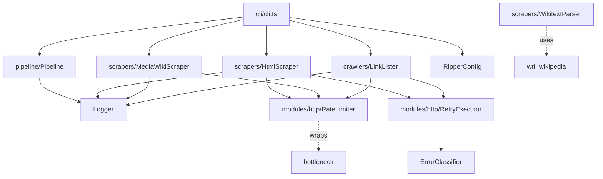
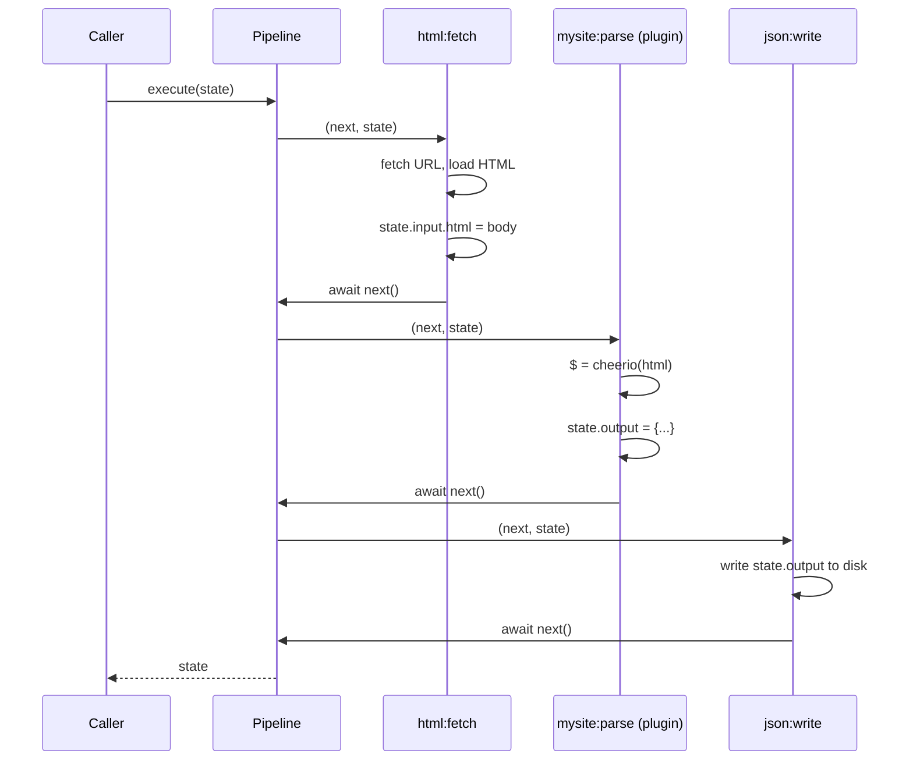
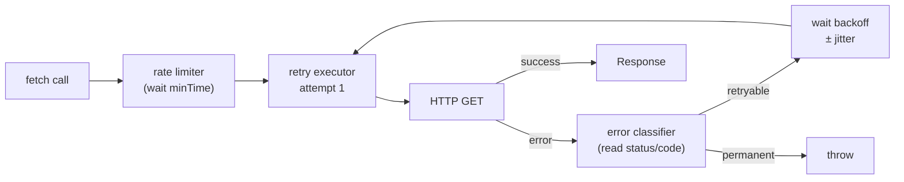

# Architecture

Three independent concerns — **pipeline**, **HTTP machinery**, and **scrapers** — compose to produce a scraping job. Nothing in the pipeline knows about HTTP. Nothing in the HTTP layer knows about MediaWiki. The scraper classes are pure data accessors that return typed results.

## Module graph



## Pipeline pattern

Typed async middleware chain where every task receives `(next, state)` and advances the queue by calling `next()`.

The core architecture is a typed middleware chain inherited from PathRipper's `Transformer` class, rewritten in TypeScript. Every task receives `(next, state)`. Calling `next()` advances to the next task; not calling it terminates the chain.

Problem being solved: Ripperoni scrapes multiple pages from multiple sources with domain-specific extraction logic per site. The pipeline decouples HTTP machinery from parsing logic. A task either advances the queue or terminates early to skip remaining tasks (e.g. if parsing fails, don't write to disk). The same `state` object flows through the entire chain; no copying, no callbacks collecting results.

State mutation contract: `TState extends Record<string, unknown>`. Tasks mutate the state reference directly. The pipeline passes the same object to every task in sequence; the caller receives the mutated reference after `execute()` returns. This avoids async callback nesting and lets each task read what previous tasks wrote.

Early termination semantics: A task that doesn't call `await next()` stops the chain. This is how you halt processing without throwing: set an error flag on state, skip `next()`, and the write task sees the flag and decides whether to write. The pipeline doesn't inspect state; it just runs whatever tasks called `next()` in their callbacks.



The `ScrapeOrchestrator` builds the pipeline per page. A user-registered `<targetId>:parse` task (from a plugin file declared in config) runs first and sets `state.output`. If no parse task is registered the orchestrator falls back to raw `WikitextParser` output. A write-to-disk task is always added last by the orchestrator.

```ts
const pipeline = new Pipeline<PipelineStateInterface>({ name: 'my-target' });
if (TaskRegistry.has('my-target:parse')) {
  pipeline.addTask(TaskRegistry.get('my-target:parse'));
}
pipeline.addTask(async (next, state) => {
  await next();
  await writeFile(outputPath, JSON.stringify(state.output ?? fallback));
});
await pipeline.execute(PipelineState.fromWikiPage('my-target', page));
```

### Task signature

```ts
type TaskFnType<TState> = (next: NextFnType, state: TState) => Promise<void>
```

`TState` must extend `Record<string, unknown>`. Tasks mutate state directly — the pipeline passes the same reference through the chain.

Why this matters: If a task decides to bail out (malformed HTML, missing required field), it skips `await next()` and the write task never runs. You don't need error handling middleware; you just don't call `next()`. This is simpler than try/catch chains and keeps the control flow local to each task.

## HTTP machinery

Three composable classes — `RateLimiter`, `RetryExecutor`, and `ErrorClassifier` — form the HTTP stack, each injected independently.

Problem being solved: HTTP is unreliable. Networks fail. Servers get overloaded and 429. Caches go stale. When Ripperoni fetches a page, it needs to retry transient errors but give up on permanent ones, respect `Retry-After` headers, and throttle to avoid hammering the target server. The three-class stack keeps these concerns separate so you can swap implementations or compose them differently in tests.

Error propagation rules: An error enters `ErrorClassifier` which examines the error object or HTTP status code. If the classifier says it's retryable (`NETWORK`, `TIMEOUT`, `THROTTLED`, `TRANSIENT`), the error goes back to `RetryExecutor` which waits and tries again. If the classifier says it's permanent (`PERMANENT`, `VALIDATION`, `RESOURCE`), the error is thrown immediately. A 404 is permanent (throw immediately). A 500 is transient (retry). A 429 is throttled (retry with `Retry-After` delay).

Cache and retry interaction: The cache sits upstream of this stack. A cache hit bypasses the entire HTTP machinery — the cached body is returned directly to the pipeline. A cache miss enters the HTTP stack: rate limiter makes you wait, then RetryExecutor calls fetch, then ErrorClassifier decides if we retry. On success, the response is cached. So the first fetch of a URL pays the full HTTP + retry cost; the second fetch hits cache and costs almost nothing.



### ErrorClassifier

Classifies errors into seven categories. Only NETWORK, THROTTLED, TIMEOUT, and TRANSIENT are retryable. Permanent 4xx errors immediately throw. Reads `Retry-After` header for THROTTLED back-off hint.

| Category | Retryable | Trigger |
|----------|-----------|---------|
| `NETWORK` | yes | `ECONNREFUSED`, `ECONNRESET`, `ENOTFOUND` |
| `TIMEOUT` | yes | `ETIMEDOUT`, `ESOCKETTIMEDOUT` |
| `THROTTLED` | yes | HTTP 429 · reads `Retry-After` |
| `TRANSIENT` | yes | HTTP 5xx |
| `PERMANENT` | no | HTTP 4xx (except 429) |
| `VALIDATION` | no | `TypeError`, `SyntaxError`, `ValidationError` |
| `RESOURCE` | no | `ENOMEM`, `ENOSPC` |

Retry-After handling: When a server returns HTTP 429 with a `Retry-After` header (in seconds or RFC 1123 date), ErrorClassifier extracts the value and returns it as a `backoffHint`. RetryExecutor uses this hint as the delay before the next attempt, overriding the exponential backoff curve. If `Retry-After` is malformed or missing, the backoff falls back to the exponential schedule. This prevents hammering a throttled server while respecting its explicit guidance.

### RetryExecutor

Wraps any async function. On retryable error: waits, retries up to `maxAttempts`. Delay uses exponential backoff with ±10% decorrelated jitter to avoid thundering herd.

Backoff formula: `delay = min(baseDelayMs * 2^attempt, maxDelayMs) ± jitter`. For `baseDelayMs=500, multiplier=2, maxDelayMs=30000`: attempt 0 (no retry) = fail immediately, attempt 1 = ~500ms, attempt 2 = ~1000ms, attempt 3 = ~2000ms, then capped at 30s. Jitter is random ±10% to prevent multiple clients from retrying in lockstep and causing a thundering herd.

| Option | Default | Description |
|--------|---------|-------------|
| `maxAttempts` | `3` | Total attempts before throw (includes first try). |
| `baseDelayMs` | `500` | Base delay for attempt 1. |
| `multiplier` | `2` | Delay multiplier per attempt. |
| `maxDelayMs` | `30000` | Delay ceiling. |

### RateLimiter

Token-bucket backed by `bottleneck`. Factory methods: `RateLimiter.perSecond(n)` for throughput-based limits, `RateLimiter.withDelay(ms)` for fixed-gap limits. Used by every scraper and crawler.

Rate limiting applies per request. If you set `rateLimitMs: 1000`, every fetch is at least 1000ms apart. If you set `jitterMs: 250`, an additional 0–250ms random delay is added per request. Jitter prevents synchronized bursts when multiple tasks start together. The limiter enforces this before the HTTP call enters the retry executor, so rate limiting happens even on retries — each retry attempt waits its own `minTime` before executing.

## Scrapers

Pure data accessors for HTML (via cheerio) and MediaWiki (via native fetch) that return typed results without coupling to the pipeline.

### HtmlScraper

Native `fetch` + `cheerio`. Returns `ScrapedPageInterface { url, $, html }`. The `$` field is a live `CheerioAPI` handle — use it exactly as you'd use jQuery on a DOM. No browser engine, no JavaScript execution. For JS-rendered pages, swap the fetch call for a headless driver (Playwright, Puppeteer) and feed the HTML to `cheerio.load()`.

### MediaWikiScraper

Direct `fetch()` calls to the MediaWiki JSON API — no mwn or axios layer. Four operations:

- `fetchPage(title)` — single page wikitext
- `fetchPagesBatch(titles)` — up to 50 pages per API request
- `fetchCategory(name)` — paginated category members list
- `fetchAllPages()` — enumerates every article in main namespace via `action=query&list=allpages`

The `ScrapeOrchestrator` selects from three modes: explicit `--category` flag → single category; `categories[]` in config → iterate and deduplicate; no categories → `fetchAllPages()`. Rate limiting and jitter applied per-request.

### WikitextParser

Wraps `wtf_wikipedia`. `WikitextParser.parse(title, wikitext)` returns a `ParsedPageInterface` with `infobox` (flat key→value record), `sections` (title + raw wikitext), and `categories`. Helper methods `infoboxField` and `infoboxNumber` pull typed values without null-checks at call site.

## Link crawler

Recursive link crawler controlled by three regexes (`domain`, `delimiter`, `target`) that bound traversal and collect matching URLs.

Three regexes control behavior:

| Regex | Purpose |
|-------|---------|
| `domain` | Links must match to be considered at all. Keeps the crawler inside the target site. |
| `delimiter` | Links that match are traversed (followed). Links that don't are ignored entirely. |
| `target` | Links that match the delimiter AND this pattern are collected as results. Others are traversed but not returned. |

Visited URLs are tracked in a `Set`. All traversals run concurrently via `Promise.all` at each level. Results are deduplicated and sorted with a numeric-aware collator — so `Item-10` sorts after `Item-9`, not between `Item-1` and `Item-2`.

## Source map

Complete index of every source file, its exported symbols, and the PathRipper or TORUS module it was ported from.

| File | Exports | Ported from |
|------|---------|-------------|
| `src/pipeline/Pipeline.ts` | `Pipeline<TState>` | PathRipper `Transformer` |
| `src/modules/http/ErrorClassifier.ts` | `ErrorClassifier`, `ErrorCategory` | TORUS `errorClassifier.ts` |
| `src/modules/http/RetryExecutor.ts` | `RetryExecutor` | TORUS `RetryPolicyNode` |
| `src/modules/http/RateLimiter.ts` | `RateLimiter` | New — wraps `bottleneck` |
| `src/modules/logger/Logger.ts` | `Logger` | Torreya `@torreya/logger` |
| `src/scrapers/HtmlScraper.ts` | `HtmlScraper` | PathRipper `fetchPage`, cheerio replaces JSDOM |
| `src/scrapers/MediaWikiScraper.ts` | `MediaWikiScraper` | New — native `fetch()` to MediaWiki JSON API |
| `src/scrapers/WikitextParser.ts` | `WikitextParser` | New — `wtf_wikipedia` |
| `src/crawlers/LinkLister.ts` | `LinkLister` | PathRipper `linkLister/index.js` |
| `src/orchestrators/ScrapeOrchestrator.ts` | `ScrapeOrchestrator` | New — pipeline orchestration, three-mode wiki scrape |
| `src/registry/TaskRegistry.ts` | `TaskRegistry` | New — plugin registration and dynamic loading |
| `src/registry/PipelineState.ts` | `PipelineState` | New — typed state bridge between scrapers and plugins |
| `src/config/RipperConfig.ts` | `RipperConfig` | New — replaces hardcoded `config.js` |
| `src/cli/cli.ts` | `ripperoni` CLI | New — `commander` |
