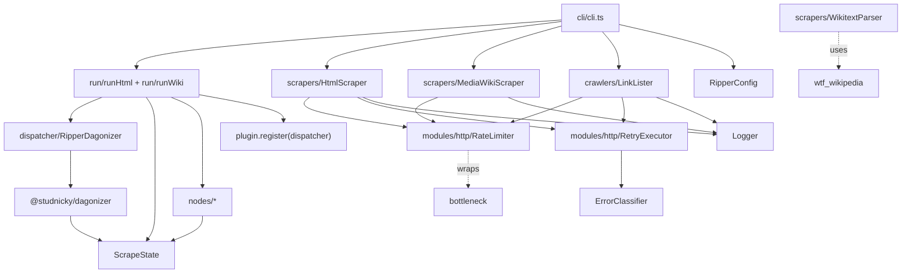
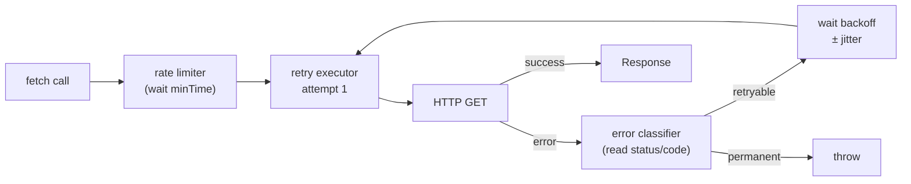

# Architecture

Three independent concerns (**pipeline**, **HTTP machinery**, and **scrapers**) compose to produce a scraping job. Nothing in the pipeline knows about HTTP. Nothing in the HTTP layer knows about MediaWiki. The scraper classes are pure data accessors that return typed results.

## Module graph



<section data-component="pipeline">

## DAG dispatch

<p class="summary">Directed acyclic graph orchestration powered by @studnicky/dagonizer — every node declares named output ports, scatter handles concurrency, and state flows checkpoint-ready through the run.</p>

Ripperoni uses `@studnicky/dagonizer` for all orchestration. A scrape run decomposes into four nested DAG levels: an **outer flow** that composes three independent **phase** DAGs (discovery, scrape, retry) via `embeddedDAG` placements, and a **per-page** DAG that materialises the user's `pipeline: [...]` config as first-class nodes. Phases are independently dispatchable for tests.

**Node contract:** Every built-in task (`html:fetch`, `json:write`, etc.) and every user plugin is a `NodeInterface<ScrapeState, TOutputs, RipperServices>`. Nodes declare named output ports (e.g. `success | error | cached`), mutate `ScrapeState`, and return `NodeOutputBuilder.of('<port>')`. The dispatcher routes to the next placement based on the port.

**Phase composition:** The outer DAG embeds each phase as an `embeddedDAG` placement with explicit `inputs`/`outputs` state mappings — the mapping seeds the child DAG's inputs and copies the relevant result buckets back to the parent. Each outer DAG ends at a `terminal` placement (`{ outcome: 'completed' }`) that owns END.

**Failure retry:** Items that fail their first per-page DAG dispatch retry exactly once. The retry phase fans out over `state.failed` and partitions outcomes into `state.recovered` (succeeded on retry) and `state.failedAfterRetry` (failed both attempts). `failures.json` is written from `state.failedAfterRetry` — first-attempt failures are not a terminal state.

**Result-array contract:** `ScrapeState` carries three terminal result arrays: `succeeded` (first-attempt successes), `recovered` (succeeded on retry), `failedAfterRetry` (failed both). The transient `failed` array is the retry phase's fan-out source and is meaningful only mid-flow.

**Config-driven pipeline:** Users declare `pipeline: ['html:fetch', 'aonprd:parse', 'json:write']` in their config. The runner compiles that list into a real dagonizer-managed per-page DAG — one `SingleNode` placement per pipeline step, chained `success → next`. Each phase fans out with a native `{ dag }` **scatter** whose body is the per-page DAG — no dispatch-wrapper node. The scatter's `itemKey` names where each item lands in state: `currentUrl` for the scrape phase, `currentRetryUrl` for the retry phase; the fetch node reads its URL from that key. Scatter `concurrency` is set to the parse worker-pool width so every worker stays fed.

### CLI dispatch DAG

The CLI layer is itself a first-class Dagonizer DAG. Each commander action handler sets up a `CliState`, registers the six CLI nodes and the `cliScrapeDAG`, dispatches via `dispatcher.execute()`, and reads `state.exitCode` for `process.exit()`. The action handler has no orchestration logic of its own.

```mermaid
<!--@include: ./_generated/cliScrapeDAG.mmd -->
```

**Branching:** `load-config` routes `error → exit` (bad config file). `resolve-target` routes to `dispatch-html-scrape` or `dispatch-wiki-scrape` based on which config collection contains `targetId`, or to `exit` when the target is unknown. Both dispatch nodes route all outcomes (`success | partial | error`) to `write-manifest`, which logs the failure summary. `exit` sets `state.exitCode` (0 = clean, 1 = error, 2 = partial) and routes to `null`.

### Outer flow

The outer DAG composes the phases as `embeddedDAG` placements with explicit `inputs`/`outputs` state mappings. Each phase runs in isolation; its mapped outputs are copied back into the parent state.

#### htmlScrapeDAG

```mermaid
<!--@include: ./_generated/htmlScrapeDAG.mmd -->
```

#### htmlScrapeDAGCrawl (with discovery)

```mermaid
<!--@include: ./_generated/htmlScrapeDAGCrawl.mmd -->
```

#### wikiScrapeDAG

```mermaid
<!--@include: ./_generated/wikiScrapeDAG.mmd -->
```

### Wiki member resolution DAG

Before the wiki scrape fan-out begins, `runWiki` dispatches `wikiResolveMembersDAG` to determine the set of page titles to scrape. The DAG selects exactly one branch based on the run options:

| Mode | Trigger | Branch node |
|------|---------|-------------|
| `resume-failures` | `--resume-failures` flag | `wiki:resume-failures` — reads `failures.json` |
| `single-category` | `--category <name>` flag | `wiki:fetch-single-category` — calls `fetchCategory()` |
| `by-categories` | `categories[]` in config | `wiki:fetch-multiple-categories` — deduplicates across all listed categories |
| `all-pages` | fallback | `wiki:fetch-all-pages` — calls `fetchAllPages()` |

Each branch node is independently dispatchable for tests. The DAG writes `state.members` on success; `runWiki` reads it to seed the page fan-out.

```mermaid
<!--@include: ./_generated/wikiResolveMembersDAG.mmd -->
```

### Phase: discovery

The discovery phase runs `crawl:list-targets` to populate `state.urls` before the scrape phase fans out. Only present in `htmlScrapeDAGCrawl`; when the user's pipeline does not reference `crawl:list-targets`, the orchestrator picks `htmlScrapeDAG` (no discovery phase).

#### htmlCrawlPhase

```mermaid
<!--@include: ./_generated/htmlCrawlPhase.mmd -->
```

### Phase: scrape

The scrape phase is the initial per-item run. The fan-out partitions outcomes into `succeeded` / `failed` based on the dispatch node's output port.

#### htmlScrapePhase

```mermaid
<!--@include: ./_generated/htmlScrapePhase.mmd -->
```

#### wikiScrapePhase

```mermaid
<!--@include: ./_generated/wikiScrapePhase.mmd -->
```

### Phase: retry

The retry phase scatters over `state.failed` exactly once. Successful retries land in `state.recovered`; persistent failures land in `state.failedAfterRetry`. The same per-page DAG runs as the scatter body; only the scatter source (`state.failed`) and `itemKey` (`currentRetryUrl` / `currentRetryTitle`) differ from the scrape phase.

#### htmlRetryPhase

```mermaid
<!--@include: ./_generated/htmlRetryPhase.mmd -->
```

#### wikiRetryPhase

```mermaid
<!--@include: ./_generated/wikiRetryPhase.mmd -->
```

### Per-page child DAG

Each target's `pipeline: [...]` config is compiled into a first-class dagonizer DAG at startup. The diagram below shows the decomposed HTML pipeline `['html:fetch', 'html:write-raw', 'json:write']` — each step is a separate node with its own output ports, registered on the same dispatcher.

#### htmlPageDAG (per-URL steps)

```mermaid
<!--@include: ./_generated/htmlPageDAG.mmd -->
```

#### wikiPageDAG (per-title steps)

```mermaid
<!--@include: ./_generated/wikiPageDAG.mmd -->
```

### Link crawler DAG

`LinkLister.buildList(urls)` dispatches the `linkCrawlDAG` — a bounded, level-by-level BFS crawler. Each depth level is a pair of nodes: `FetchAndExtractLinksNode` (processes all frontier URLs, writes discovered links to accumulator fields) and `DedupeAndEnqueueNode` (deduplicates, promotes to next frontier, routes to `exhausted` on empty or budget/depth limit). Up to 16 levels are unrolled at compile time; `DedupeAndEnqueueNode` enforces `maxPages` and `maxDepth` at runtime.

```mermaid
<!--@include: ./_generated/linkCrawlDAG.mmd -->
```

| Node | Output ports | Responsibility |
|------|-------------|----------------|
| `init-frontier` | `ready \| empty` | Sets `state.frontier = state.seedUrls`, resets accumulators |
| `fetch-N` | `success \| empty \| error \| permanent` | Fetches all frontier URLs, writes traversable links to `nextFrontierRaw`, targets to `discoveredRaw` |
| `dedupe-N` | `frontier-ready \| frontier-empty \| budget-exhausted` | Deduplicates, promotes accumulators, advances `state.depth` |
| `exhausted` | `success` | Final sort + dedup of `state.discovered`; numerically-aware collation |

### Config load DAG

`RipperConfig.load(path)` dispatches the `configLoadDAG` — a five-node linear pipeline that keeps each concern independently testable. `state.path` is the only input; `state.normalized` is the output.

```mermaid
<!--@include: ./_generated/configLoadDAG.mmd -->
```

| Node | Output ports | Responsibility |
|------|-------------|----------------|
| `read-file` | `success \| not-found \| error` | `readFile(state.path)` → `state.raw` |
| `parse-json` | `success \| error` | `JSON.parse(state.raw)` → `state.parsed` |
| `validate-schema` | `valid \| invalid` | AJV validation against `RipperConfigSchema` |
| `normalize-cache` | `success \| invariant-violated` | Cache defaults + raw/cache-off invariant |
| `assert-invariants` | `success \| invariant-violated` | Post-normalize checks (e.g. no `api:fetch`) |

All non-success routes terminate at `null`; `state.errors` carries the failure details that `RipperConfig.load()` merges into a `RipperConfigError`.

### Plugin DAGs

Every plugin in Ripperoni is registered as a DAG (Flavor 2 universal pattern). Trivial plugins wrap a single `NodeInterface` in a 1-node DAG; complex plugins decompose into multi-node branching DAGs. The orchestrator's pipeline-name resolution checks the DAG registry first, then the node registry — plugins are interchangeable from the config-author's perspective.

When a pipeline step like `aonprd:parse` resolves to a registered DAG, the runner emits an `embeddedDAG` placement in the per-page DAG. The placement's output mapping copies the child DAG's `state.output` back to the parent so downstream steps (e.g. `json:write`) see the parsed record.

#### Plugin DAG: AON parse

The AON plugin is **taxonomy-routed**, not a hand-wired node list. Its entrypoint `aonprd:taxonomy-route` classifies each page from its URL and dispatches to that concept's inherited capability chain (spell, monster, feat, weapon, …); unrecognised pages route to `aonprd:make-unknown`. The whole DAG is compiled from the concept taxonomy by `TAXONOMY.buildDAG()`, so adding a concept extends the taxonomy rather than this graph by hand. See the [AONPRD Scraper DAG](/aonprd-scraper-dag) walkthrough for the full composition.

```mermaid
<!--@include: ./_generated/aonprdParseDAG.mmd -->
```

#### Plugin DAG: docs-scraper (trivial 1-node wrapper)

```mermaid
<!--@include: ./_generated/docsScraperDAG.mmd -->
```

#### Plugin DAG: wiki-docs (trivial 1-node wrapper)

```mermaid
<!--@include: ./_generated/wikiDocsDAG.mmd -->
```

### Node signature

```ts
interface NodeInterface<TState, TOutput extends string, TServices = undefined> {
  readonly name:    string;
  readonly outputs: readonly TOutput[];
  execute(state: TState, context: NodeContextInterface<TServices>): Promise<{ output: TOutput }>;
}
```

Nodes never throw. Errors are recorded via `state.collectError(err)` and a deterministic port (`error`, `invalid`, `empty`) is returned so the DAG can route to a failure handler or terminate cleanly.

</section>

<section data-component="http-layer">

## HTTP machinery

<p class="summary">Three composable classes — RateLimiter, RetryExecutor, and ErrorClassifier — form the HTTP stack, each injected independently.</p>

Three composable classes (`RateLimiter`, `RetryExecutor`, and `ErrorClassifier`) form the HTTP stack, each injected independently.

Problem being solved: HTTP is unreliable. Networks fail. Servers get overloaded and 429. Caches go stale. When Ripperoni fetches a page, it needs to retry transient errors but give up on permanent ones, respect `Retry-After` headers, and throttle to avoid hammering the target server. The three-class stack keeps these concerns separate so you can swap implementations or compose them differently in tests.

Error propagation rules: An error enters `ErrorClassifier` which examines the error object or HTTP status code. If the classifier says it's retryable (`NETWORK`, `TIMEOUT`, `THROTTLED`, `TRANSIENT`), the error goes back to `RetryExecutor` which waits and tries again. If the classifier says it's permanent (`PERMANENT`, `VALIDATION`, `RESOURCE`), the error is thrown immediately. A 404 is permanent (throw immediately). A 500 is transient (retry). A 429 is throttled (retry with `Retry-After` delay).

Cache and retry interaction: The cache sits upstream of this stack. A cache hit bypasses the entire HTTP machinery; the cached body is returned directly to the pipeline. A cache miss enters the HTTP stack: rate limiter makes you wait, then RetryExecutor calls fetch, then ErrorClassifier decides if we retry. On success, the response is cached. So the first fetch of a URL pays the full HTTP + retry cost; the second fetch hits cache and costs almost nothing.



### ErrorClassifier

Classifies errors into seven categories. Only NETWORK, THROTTLED, TIMEOUT, and TRANSIENT are retryable. Permanent 4xx errors immediately throw. Reads `Retry-After` header for THROTTLED back-off hint.

| Category | Retryable | Trigger |
|----------|-----------|---------|
| `NETWORK` | yes | `ECONNREFUSED`, `ECONNRESET`, `ENOTFOUND` |
| `TIMEOUT` | yes | `ETIMEDOUT`, `ESOCKETTIMEDOUT` |
| `THROTTLED` | yes | HTTP 429 · reads `Retry-After` |
| `TRANSIENT` | yes | HTTP 5xx |
| `PERMANENT` | no | HTTP 4xx (except 429) |
| `VALIDATION` | no | `TypeError`, `SyntaxError`, `ValidationError` |
| `RESOURCE` | no | `ENOMEM`, `ENOSPC` |

Retry-After handling: When a server returns HTTP 429 with a `Retry-After` header (in seconds or RFC 1123 date), ErrorClassifier extracts the value and returns it as a `backoffHint`. RetryExecutor uses this hint as the delay before the next attempt, overriding the exponential backoff curve. If `Retry-After` is malformed or missing, the backoff falls back to the exponential schedule. This prevents hammering a throttled server while respecting its explicit guidance.

### RetryExecutor

Wraps any async function. On retryable error: waits, retries up to `maxAttempts`. Delay uses exponential backoff with ±10% decorrelated jitter to avoid thundering herd.

Backoff formula: `delay = min(baseDelayMs * 2^attempt, maxDelayMs) ± jitter`. For `baseDelayMs=500, multiplier=2, maxDelayMs=30000`: attempt 0 (no retry) = fail immediately, attempt 1 = ~500ms, attempt 2 = ~1000ms, attempt 3 = ~2000ms, then capped at 30s. Jitter is random ±10% to prevent multiple clients from retrying in lockstep and causing a thundering herd.

| Option | Default | Description |
|--------|---------|-------------|
| `maxAttempts` | `3` | Total attempts before throw (includes first try). |
| `baseDelayMs` | `500` | Base delay for attempt 1. |
| `multiplier` | `2` | Delay multiplier per attempt. |
| `maxDelayMs` | `30000` | Delay ceiling. |

### RateLimiter

Token-bucket backed by `bottleneck`. Factory methods: `RateLimiter.perSecond(n)` for throughput-based limits, `RateLimiter.withDelay(ms)` for fixed-gap limits. Used by every scraper and crawler.

Rate limiting applies per request. If you set `rateLimitMs: 1000`, every fetch is at least 1000ms apart. If you set `jitterMs: 250`, an additional 0–250ms random delay is added per request. Jitter prevents synchronized bursts when multiple tasks start together. The limiter enforces this before the HTTP call enters the retry executor, so rate limiting happens even on retries; each retry attempt waits its own `minTime` before executing.

</section>

<section data-component="scrapers">

## Scrapers

<p class="summary">Pure data accessors for HTML (via cheerio) and MediaWiki (via native fetch) that return typed results without coupling to the pipeline.</p>

Pure data accessors for HTML (via cheerio) and MediaWiki (via native fetch) that return typed results without coupling to the pipeline.

### HtmlScraper

Native `fetch` + `cheerio`. Returns `ScrapedPageInterface { url, $, html }`. The `$` field is a live `CheerioAPI` handle; use it exactly as you'd use jQuery on a DOM. No browser engine, no JavaScript execution. For JS-rendered pages, swap the fetch call for a headless driver (Playwright, Puppeteer) and feed the HTML to `cheerio.load()`.

### MediaWikiScraper

Direct `fetch()` calls to the MediaWiki JSON API; no mwn or axios layer. Four operations:

- `fetchPage(title)`: single page wikitext
- `fetchPagesBatch(titles)`: up to 50 pages per API request
- `fetchCategory(name)`: paginated category members list
- `fetchAllPages()`: enumerates every article in main namespace via `action=query&list=allpages`

`runWiki` selects from three modes: explicit `--category` flag → single category; `categories[]` in config → iterate and deduplicate; no categories → `fetchAllPages()`. Rate limiting and jitter applied per-request.

### WikitextParser

Wraps `wtf_wikipedia`. `WikitextParser.parse(title, wikitext)` returns a `ParsedPageInterface` with `infobox` (flat key→value record), `sections` (title + raw wikitext), and `categories`. Helper methods `infoboxField` and `infoboxNumber` pull typed values without null-checks at call site.

</section>

<section data-component="crawler">

## Link crawler

<p class="summary">Recursive link crawler controlled by three regexes (domain, delimiter, target) that bound traversal and collect matching URLs.</p>

Recursive link crawler controlled by three regexes (`domain`, `delimiter`, `target`) that bound traversal and collect matching URLs.

Three regexes control behavior:

| Regex | Purpose |
|-------|---------|
| `domain` | Links must match to be considered at all. Keeps the crawler inside the target site. |
| `delimiter` | Links that match are traversed (followed). Links that don't are ignored entirely. |
| `target` | Links that match the delimiter AND this pattern are collected as results. Others are traversed but not returned. |

Visited URLs are tracked in a `Set`. All traversals run concurrently via `Promise.all` at each level. Results are deduplicated and sorted with a numeric-aware collator; so `Item-10` sorts after `Item-9`, not between `Item-1` and `Item-2`.

</section>

<section data-component="source-map">

## Source map

<p class="summary">Complete index of every source file, its exported symbols, and the PathRipper or TORUS module it was ported from.</p>

Complete index of every source file, its exported symbols, and the PathRipper or TORUS module it was ported from.

| File | Exports | Notes |
|------|---------|-------|
| `src/state/ScrapeState.ts` | `ScrapeState` | Extends `NodeStateBase`; checkpoint-ready |
| `src/nodes/HtmlFetchNode.ts` | `HtmlFetchNode` | Ports: `success \| error \| cached` |
| `src/nodes/WikiFetchNode.ts` | `WikiFetchNode` | Ports: `success \| error` |
| `src/nodes/HtmlWriteRawNode.ts` | `HtmlWriteRawNode` | Ports: `success` |
| `src/nodes/WikiWriteRawNode.ts` | `WikiWriteRawNode` | Ports: `success` |
| `src/nodes/JsonWriteNode.ts` | `JsonWriteNode` | Ports: `success \| skipped` |
| `src/nodes/JsonlAppendNode.ts` | `JsonlAppendNode` | Ports: `success \| skipped` |
| `src/nodes/ValidateSchemaNode.ts` | `ValidateSchemaNode` | Ports: `valid \| invalid` |
| `src/nodes/CrawlListTargetsNode.ts` | `CrawlListTargetsNode` | Ports: `success \| error \| empty` |
| `src/run/runHtml.ts` | `runHtml` | HTML scrape entry point; builds dispatcher, loads plugins, dispatches outer DAG |
| `src/run/runWiki.ts` | `runWiki` | Wiki scrape entry point; member resolution, batch loop, dispatches outer DAG |
| `src/dispatcher/RipperDagonizer.ts` | `RipperDagonizer` | `Dagonizer` subclass with lifecycle logging and contract-warning collection |
| `src/services/RipperServices.ts` | `RipperServices` | Services bag interface injected into every node via `context.services` |
| `src/modules/http/ErrorClassifier.ts` | `ErrorClassifier`, `ErrorCategory` | TORUS `errorClassifier.ts` |
| `src/modules/http/RetryExecutor.ts` | `RetryExecutor` | TORUS `RetryPolicyNode` |
| `src/modules/http/RateLimiter.ts` | `RateLimiter` | New: wraps `bottleneck` |
| `src/modules/logger/Logger.ts` | `Logger` | Torreya `@torreya/logger` |
| `src/scrapers/HtmlScraper.ts` | `HtmlScraper` | PathRipper `fetchPage`, cheerio replaces JSDOM |
| `src/scrapers/MediaWikiScraper.ts` | `MediaWikiScraper` | Native `fetch()` to MediaWiki JSON API |
| `src/scrapers/WikitextParser.ts` | `WikitextParser` | `wtf_wikipedia` |
| `src/crawlers/LinkLister.ts` | `LinkLister` | PathRipper `linkLister/index.js` |
| `src/config/RipperConfig.ts` | `RipperConfig` | Replaces hardcoded `config.js` |
| `src/cli/cli.ts` | `ripperoni` CLI | `commander` |

</section>
