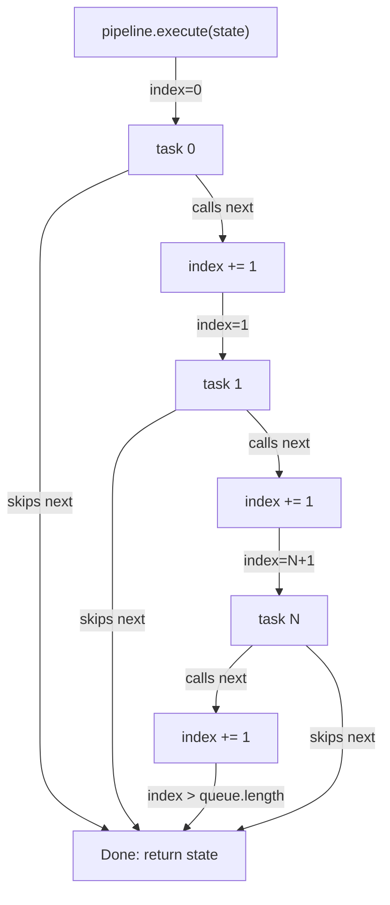

# Pipeline

The pipeline is a typed async middleware queue. Tasks receive `(next, state)`. Call `next()` to hand off; skip it to terminate the chain early.

Problem: Ripperoni needs to fetch a page, parse it with domain-specific logic (your plugin), and write it to disk; three separate concerns. The pipeline lets you plug in custom extraction logic (your parse task) without touching the HTTP or I/O machinery. Each task sees the state that previous tasks wrote and can add to it or skip execution.

State machine: Each task either calls `await next()` to advance the queue or returns without calling it to terminate. There's no error handling middleware; if your parse task encounters invalid HTML, it just doesn't set `state.output` and skips `next()`. The write task sees `output === null` and decides (per config) whether to fail, warn, or skip the file. This gives you local control without exception bubbling.

```ts
type TaskFnType<TState> = (next: () => Promise<void>, state: TState) => Promise<void>
```

`TState` extends `Record<string, unknown>`. Tasks mutate state directly; the same reference flows through the whole chain.



Why this matters: You can halt processing without throwing errors. If a task decides the data is too bad to parse, it returns without calling `next()`. The write task downstream sees the flag or missing field and handles it gracefully. No try/catch nesting, no promise rejection winding back up the stack.

## TaskRegistry

Tasks are registered by name and resolved at pipeline build time.

```ts
import { TaskRegistry } from 'ripperoni/registry/TaskRegistry';

// Self-registration at import time (the standard pattern)
TaskRegistry.register('mywiki:parse', async (next, state) => {
  // ... extract data from state.input.html or state.input.wikitext ...
  state.output = { /* your record */ };
  await next();
});
```

Built-in tasks (`html:fetch`, `json:write`) are pre-registered. Plugin tasks register themselves when loaded.

Load a plugin file dynamically:

```ts
await TaskRegistry.load('./plugins/mywiki.js');
```

The module's top-level `TaskRegistry.register(...)` calls fire on import.

## State shape

```ts
interface PipelineStateInterface {
  targetId: string;              // target or mediawiki block name
  source:   InputSourceInterface;
  input:    Record<string, unknown>;  // populated by html:fetch / wiki scraper
  output:   Record<string, unknown> | null;  // populated by your parse task
  // ... plus any extra keys tasks attach
}
```

`state.input.html`; raw HTML string, set by `html:fetch`.
`state.input.wikitext`; raw wikitext string, set by wiki fetch.
`state.input.url`; the URL fetched.

`state.output`; set by your parse task. `json:write` serializes this to disk.

Tasks can attach extra keys using the `Record<string, unknown>` index signature. This is how tasks pass data to each other without coupling to canonical fields.

## Built-in tasks

| Name | What it does |
|------|-------------|
| `html:fetch` | Rate-limited fetch with retry + backoff. Reads from cache on hits. Sets `state.input.html`. |
| `json:write` | Writes `state.output` to `<basePath>/<target>/<slug>.json`. |

## The parse task pattern

Your plugin's task is the only domain-specific code you write. It receives `state.input.html` (or `state.input.wikitext` for wiki targets) and sets `state.output`:

```ts
import type { CheerioAPI } from 'cheerio';
import * as cheerio from 'cheerio';

TaskRegistry.register('mysite:parse', async (next, state) => {
  const html = state.input['html'] as string;
  const url  = state.input['url'] as string;
  const $    = cheerio.load(html);

  state.output = {
    _type:  'article',
    url,
    title:  $('h1').first().text().trim(),
    body:   $('#content').text().trim(),
    _source: { target: state.targetId, url, plugin: 'mysite:parse' },
  };

  await next();
});
```

No HTTP in the plugin. No file I/O in the plugin. The pipeline handles both. Your plugin just reads the HTML and writes a record.

## Ordering and early termination

```
html:fetch  →  mysite:parse  →  json:write
```

`html:fetch` must come first. `json:write` must come last. Your parse task goes in between.

Early termination: If `html:fetch` encounters a permanent HTTP error (e.g. 404) it throws, halting the pipeline. If your parse task finds malformed HTML it can skip `await next()` to prevent `json:write` from running. There's no explicit error handling middleware; control flow is implicit: a task either advances the queue or halts it.

Unregistered task error: If your config names a pipeline task that doesn't exist (e.g. `["html:fetch", "nonexistent:parse", "json:write"]`), the error surfaces at orchestration time (when building the pipeline), not at runtime. The orchestrator calls `TaskRegistry.get()` which throws if the task is not registered. This means typos in your config fail fast before the scrape starts.

For wiki targets, the orchestrator handles the fetch; your task receives a pre-populated `state.input` and sets `state.output`. The write task is always added last by the orchestrator.

Task-name collision: If two tasks register the same name (e.g. two plugins both call `TaskRegistry.register('aonprd:parse', ...)`), the second registration overwrites the first. There's no warning or error. The last-loaded plugin wins. This is by design; your test plugins can shadow the production ones. If you're seeing the wrong task execute, check plugin load order in your config.

## ScrapeOrchestrator

You don't build the pipeline directly; the `ScrapeOrchestrator` builds it per page from the target config. It:

1. Resolves the target's `pipeline` array against the registry.
2. Optionally prepends the fetch task.
3. Appends the write task.
4. Calls `pipeline.execute(state)` for each page URL or wiki page.

If you want to run a pipeline directly in code (tests, scripts):

```ts
import { Pipeline } from 'ripperoni/pipeline/Pipeline';
import { PipelineState } from 'ripperoni/registry/PipelineState';

const pipeline = new Pipeline<PipelineStateInterface>({ name: 'mysite' });
pipeline.addTaskByName('mysite:parse');
pipeline.addTask(async (next, state) => { console.log(state.output); await next(); });

await pipeline.execute(PipelineState.fromHtmlPage('mysite', url, html));
```

## The _type discriminator convention

Put a `_type` field on every output record. Downstream tools use it for classification. The `_source` block makes records traceable back to their origin:

```ts
state.output = {
  _type:   'spell',              // discriminator
  url,
  name,
  level,
  _source: {
    target: state.targetId,
    url,
    plugin: 'mywiki:parse',
  },
};
```

## Related

- [Configuration](./configuration); pipeline declaration in config
- [Scrapers](./scrapers); what html:fetch hands your plugin
- [MediaWiki](./mediawiki); wiki-specific state shape
- [Plugins](./plugins); full plugin authoring guide
